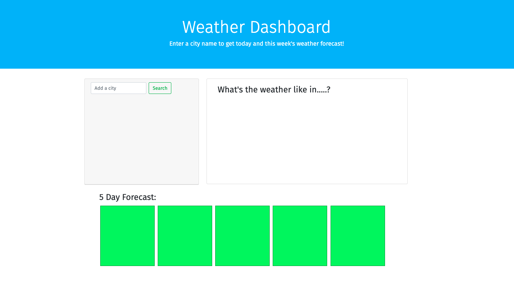
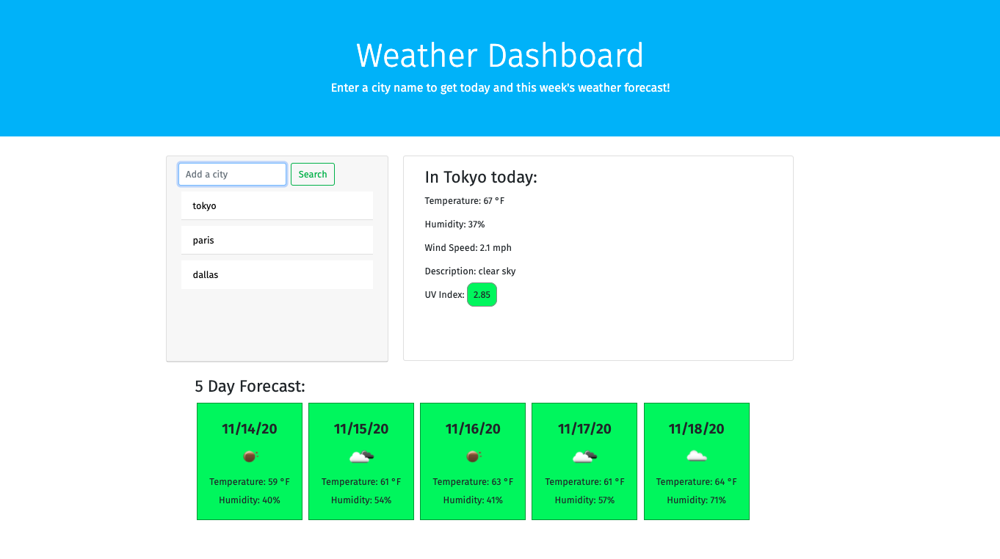

# Weather Dashboard

This app will provide the user with current and future weather data from the cities of their choosing. The current data inlcudes the temperature, humidity, UV index, wind speed, and description (such as overcast). The future data presents the next five days data of date, temperature, humidity, and an icon displaying the "description" (such as a sun icon for sunny). The user can input up to 5 cities and receive the data for each previous one by clicking the button of the city under the input field. When the user leaves and returns to the page, the last searched city will be the one whose data is displayed on the page. Upon intially visiting the site, the app looks like figure 1. Once the user enters a city or two, it looks like figure 2.

Figure 1:

Figure 2: 

One can access the app here: https://jesscru.github.io/weather-dashboard/ 