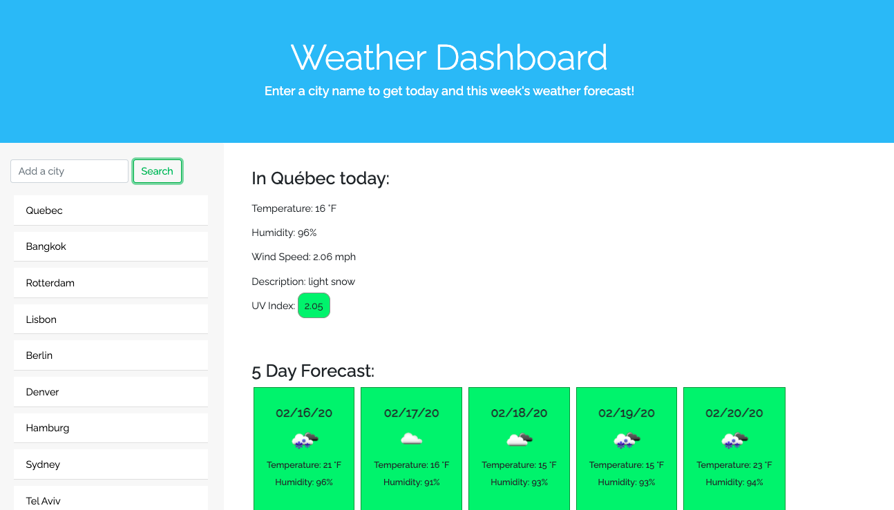

# Weather Dashboard

## Table of Contents 

* [Installation](#installation)
* [Usage](#usage)
* [Credits](#credits)
* [License](#license)
* [Contributing](#contributing)

## Installation 

One can access the app here: https://jesscru.github.io/weather-dashboard/ 

## Usage

This app will provide the user with current and future weather data from the cities of their choosing. The current data inlcudes the temperature, humidity, UV index, wind speed, and description (such as overcast). The future data presents the next five days data of date, temperature, humidity, and an icon displaying the "description" (such as a sun icon for sunny). The user can input up to 5 cities and receive the data for each previous one by clicking the button of the city under the input field. When the user leaves and returns to the page, the last searched city will be the one whose data is displayed on the page. Upon intially visiting the site, the app looks like figure 1. Once the user enters a city or two, it looks like figure 2.

Figure 1:

Figure 2: 

## Credits

The [OpenWeather API](https://openweathermap.org/api) was used to retrieve weather data for inputed cities and the retrieval of the icons.

The page is hosted by Github pages. 

## License 

This project has MIT license. 

## Contributing 

I welcome any ideas anyone might have to contribute to this project. Please reach me at the email below if you have suggestions or ideas you'd like to add to the project. 

## Questions 

Github username: jesscru

Github repository page: github.com/jesscru

If you have additonal questions or comments you can reach me at my email: jessicacrump7@gmail.com
